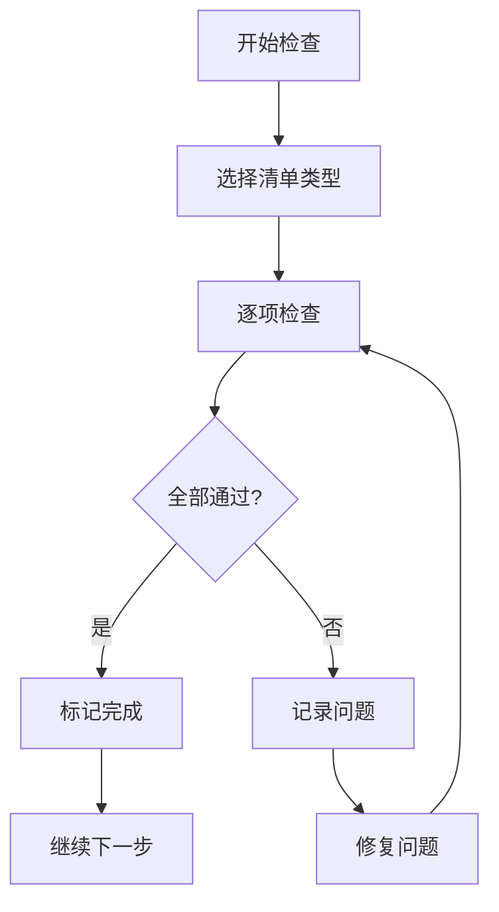

# 检查清单集合

> **质量保证** - 确保代码质量和项目标准

---

## 📋 清单概览

### 🎯 核心检查清单
- [Pre-commit检查](./pre-commit.md) - 提交代码前必查项
- [代码审查清单](./code-review.md) - Code Review标准清单
- [性能检查清单](./performance.md) - 性能优化检查项
- [安全检查清单](./security.md) - 安全漏洞检查

### 🚀 开发阶段清单
- [需求分析清单](./requirements.md) - 需求完整性检查
- [设计评审清单](./design.md) - 技术设计方案检查
- [测试检查清单](./testing.md) - 测试覆盖度检查
- [发布检查清单](./release.md) - 上线前最终检查

---

## 🔄 使用方式

### 📝 何时使用检查清单

```yaml
开发过程中:
  - Pre-commit: 每次提交前
  - 性能检查: 功能完成后
  - 安全检查: 涉及敏感数据时

质量保证:
  - 代码审查: PR提交时
  - 测试检查: 测试完成后
  - 发布检查: 上线前

特殊场景:
  - 重构前: 设计评审
  - 性能问题: 性能检查
  - 安全漏洞: 安全检查
```

### 🎯 检查流程



---

## 📊 清单统计

### ✅ 核心清单指标

| 清单类型 | 检查项数量 | 必须通过 | 建议通过 | 平均耗时 |
|---------|-----------|----------|----------|----------|
| Pre-commit | 12项 | 8项 | 4项 | 5分钟 |
| Code Review | 18项 | 12项 | 6项 | 15分钟 |
| Performance | 15项 | 8项 | 7项 | 10分钟 |
| Security | 20项 | 15项 | 5项 | 20分钟 |

### 📈 质量趋势
- **代码质量**: 逐步提升 (目标: 95%通过率)
- **Bug率**: 持续下降 (目标: <1%)
- **性能指标**: 稳定优化 (目标: <2秒响应时间)
- **安全漏洞**: 零容忍 (目标: 0个高危漏洞)

---

## 🛠️ 工具集成

### 🤖 自动化检查
```yaml
Git Hooks:
  - Pre-commit: 自动运行基础检查
  - Pre-push: 运行完整测试套件

CI/CD Pipeline:
  - 代码质量检查
  - 安全扫描
  - 性能测试
  - 依赖漏洞检查
```

### 📱 手动检查
```yaml
开发工具:
  - IDE插件集成
  - 浏览器扩展
  - 代码编辑器快捷键

团队协作:
  - PR模板集成
  - 代码审查工具
  - 项目��理软件
```

---

## 🎯 最佳实践

### ✅ 使用建议
1. **逐项检查**: 不要跳过任何检查项
2. **及时记录**: 发现问题立即记录并修复
3. **团队同步**: 检查结果与团队共享
4. **持续改进**: 定期更新检查清单

### ⚠️ 常见误区
```yaml
❌ 错误做法:
  - 跳过检查项
  - 流于形式
  - 不记录问题
  - 孤立执行

✅ 正确做法:
  - 严格执行
  - 实质检查
  - 详细记录
  - 团队协作
```

---

## 📝 反馈与改进

### 🔄 持续优化
- **每月回顾**: 分析检查清单使用情况
- **季度更新**: 根据项目发展调整清单
- **年度评估**: 全面评估清单有效性

### 📊 数据驱动
- **收集指标**: 检查通过率、问题发现率
- **分析趋势**: 质量变化趋势
- **制定目标**: 基于数据设定改进目标

---

## 🎯 快速导航

### 根据场景选择
```yaml
日常开发:
  → pre-commit.md
  → performance.md

代码审查:
  → code-review.md
  → security.md

项目里程碑:
  → release.md
  → testing.md

特殊需求:
  → requirements.md
  → design.md
```

### 根据角色选择
```yaml
开发者:
  - pre-commit.md
  - performance.md

代码审查者:
  - code-review.md
  - security.md

测试工程师:
  - testing.md
  - release.md

项目经理:
  - requirements.md
  - design.md
```

---

**最后更新**: 2025-10-31
**版本**: v1.0.0
**维护者**: 质量保证团队