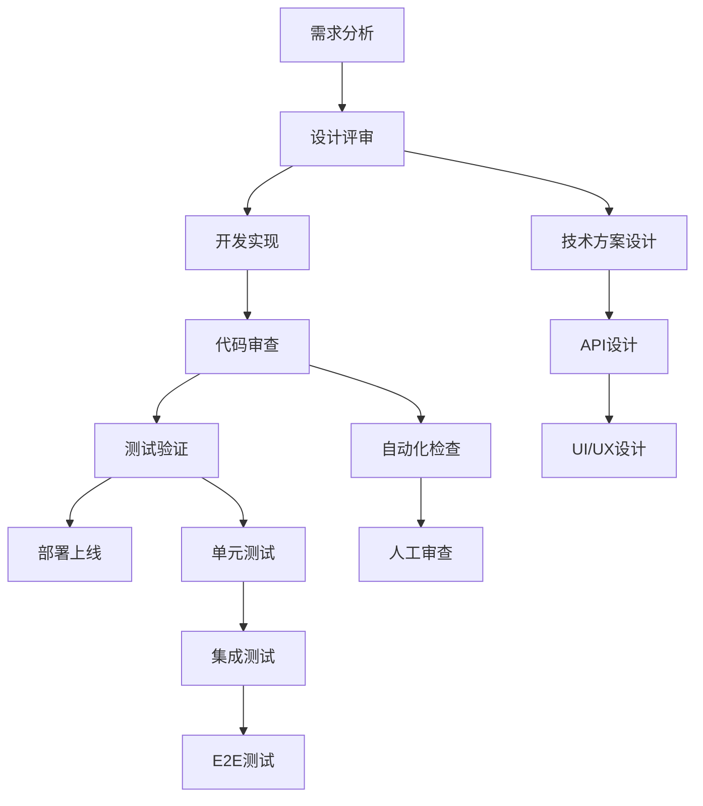

# 工作流程文档

> **标准化流程** - 提高开发效率与代码质量

---

## 🔄 流程概览



---

## 📋 工作流程列表

### 🚀 开发流程
- [新功能开发流程](./new-feature.md) - 从需求到上线的完整流程
- [Bug修复流程](./bug-fix.md) - Bug定位与修复标准流程
- [重构优化流程](./refactor.md) - 代码重构与性能优化

### 🔍 质量保证
- [代码审查流程](./code-review.md) - 代码质量检查标准
- [测试流程](./testing.md) - 测试策略与执行
- [发布流程](./release.md) - 版本发布与部署

### 🛠️ 开发工具
- [环境配置流程](./environment.md) - 开发环境搭建
- [Git工作流程](./git-workflow.md) - 版本控制最佳实践
- [调试流程](./debugging.md) - 问题排查与调试

---

## 🎯 快速选择流程

### 根据任务类型

```yaml
开发新功能:
  1. new-feature.md
  2. code-review.md
  3. testing.md
  4. release.md

修复Bug:
  1. bug-fix.md
  2. code-review.md
  3. testing.md

代码重构:
  1. refactor.md
  2. code-review.md
  3. testing.md

性能优化:
  1. refactor.md
  2. testing.md
  3. debugging.md
```

### 根据开发阶段

```yaml
需求阶段:
  - 需求分析
  - 技术方案设计
  - API设计

开发阶段:
  - 环境配置
  - 功能实现
  - 单元测试

测试阶段:
  - 代码审查
  - 集成测试
  - E2E测试

发布阶段:
  - 构建打包
  - 部署验证
  - 监控观察
```

---

## 🔄 流程集成

### 持续集成 (CI)
所有工作流程都与CI/CD系统集成：
- 自动化测试
- 代码质量检查
- 安全扫描
- 性能监控

### 项目管理
工作流程与项目管理工具对接：
- 任务分解
- 进度跟踪
- 质量度量
- 团队协作

---

## 📊 流程优化

### 📈 效率指标
- **代码提交频率**: 每日≥2次
- **代码审查时间**: <24小时
- **Bug修复时间**: <48小时
- **新功能交付**: <5个工作日

### 🔧 改进机制
- **定期回顾**: 每两周团队回顾
- **流程优化**: 基于数据和反馈调整
- **工具升级**: 持续更新开发工具
- **培训计划**: 定期团队技能培训

---

## �� 使用指南

### 📖 新手入门
1. 阅读所有工作流程文档
2. 跟随导师完成一个完整流程
3. 独立执行简单任务
4. 逐步承担复杂任务

### 🎯 最佳实践
- 严格按照流程执行
- 及时记录遇到的问题
- 主动提出改进建议
- 定期更新流程文档

### ⚠️ 注意事项
- 流程是指导而非束缚
- 特殊情况可以灵活处理
- 所有修改都需要团队讨论
- 保持文档的及时更新

---

**最后更新**: 2025-10-31
**版本**: v1.0.0
**维护者**: 开发团队