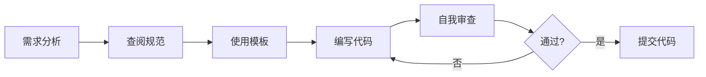

# Vue3 Element Admin - Claude 规则体系完整指南

> 🎉 恭喜！您已获得完整的 Vue3 + TypeScript + Element Plus 项目开发规范体系

---

## 📚 文档结构总览

```
.claude/
├── README.md                      # 📖 规则体系入口（从这里开始）
├── project-rules.md               # ⭐ 项目核心规则
├── state-management-guide.md      # 🗄️ Pinia 状态管理
├── api-guidelines.md              # 🌐 API 调用规范
├── style-guide.md                 # 🎨 样式与UI规范
├── quick-reference.md             # 🚀 快速参考手册
└── templates/                     # 📦 代码模板
    └── component-template.vue     # 组件模板
```

---

## 🎯 核心价值

### 为什么需要这套规则？

1. **统一标准** ✅
   - 团队成员遵循相同规范
   - 代码风格一致，易于维护
   - 降低沟通成本

2. **提升质量** ✅
   - TypeScript 类型安全
   - 完善的错误处理
   - 性能最佳实践

3. **加速开发** ✅
   - 开箱即用的模板
   - 清晰的示例代码
   - 减少决策时间

4. **降低风险** ✅
   - 安全编码规范
   - 可维护的架构
   - 完整的审查清单

---

## 🚀 快速上手

### 第一步：阅读核心文档

**必读文档（30分钟）**:
1. [.claude/README.md](.claude/README.md) - 规则体系概览
2. [.claude/project-rules.md](.claude/project-rules.md) - 核心规范

**按需阅读**:
- 🗄️ [Pinia 状态管理](.claude/state-management-guide.md) - 学习状态管理
- 🌐 [API 调用规范](.claude/api-guidelines.md) - 学习 API 封装
- 🎨 [样式规范](.claude/style-guide.md) - 学习样式编写
- 🚀 [快速参考](.claude/quick-reference.md) - 常用代码片段

### 第二步：使用代码模板

```bash
# 创建新组件
cp .claude/templates/component-template.vue src/components/MyComponent/index.vue

# 编辑组件，替换模板中的占位符
```

### 第三步：遵循开发流程

#### 1. 创建功能分支
```bash
git checkout -b feature/user-management
```

#### 2. 按规范开发
- ✅ 使用 TypeScript 严格类型
- ✅ 遵循命名规范
- ✅ 编写单元测试
- ✅ 添加必要注释

#### 3. 代码审查检查
参考 [代码审查清单](.claude/README.md#代码审查清单)

#### 4. 提交代码
```bash
git add .
git commit -m "feat: 添加用户管理功能"
git push origin feature/user-management
```

---

## 📖 规范要点速览

### 命名规范

| 类型 | 规范 | 示例 |
|------|------|------|
| 组件文件 | PascalCase | `UserProfile/index.vue` |
| Composables | camelCase + use | `usePermission.ts` |
| 常量 | UPPER_SNAKE_CASE | `MAX_RETRY_COUNT` |
| 类型/接口 | PascalCase | `UserInfo`, `ApiResponse` |
| 变量/函数 | camelCase | `userName`, `fetchData()` |

### Vue 3 Composition API

```typescript
// ✅ 推荐：使用 <script setup>
<script setup lang="ts">
import { ref, computed, onMounted } from 'vue'

// Props
interface Props {
  userId: string
}
const props = defineProps<Props>()

// State
const user = ref<UserInfo | null>(null)

// Computed
const displayName = computed(() => user.value?.name || '未知')

// Methods
async function fetchUser() {
  // ...
}

// Lifecycle
onMounted(() => {
  fetchUser()
})
</script>
```

### Pinia Store

```typescript
// ✅ 推荐：Setup Syntax
export const useUserStore = defineStore('user', () => {
  // State
  const token = ref('')

  // Getters
  const isLoggedIn = computed(() => !!token.value)

  // Actions
  async function login(credentials) {
    // ...
  }

  return { token, isLoggedIn, login }
})
```

### API 封装

```typescript
// ✅ 类型定义完整
export interface UserInfo {
  id: string
  name: string
  email: string
}

// ✅ 函数签名清晰
export function getUserInfo() {
  return request<ApiResponse<UserInfo>>({
    url: '/user/info',
    method: 'get',
  })
}
```

### 样式编写

```scss
// ✅ BEM 命名 + Scoped
<style lang="scss" scoped>
@import '@/styles/variables.scss';

.user-card {
  padding: $spacing-lg;

  &__header {
    font-size: 18px;
  }

  &--large {
    width: 500px;
  }

  &.is-active {
    border-color: $primary-color;
  }
}
</style>
```

---

## ✅ 代码质量检查清单

### 组件开发
- [ ] 使用 TypeScript 严格类型
- [ ] Props 和 Emits 类型定义完整
- [ ] 使用 Composition API (`<script setup>`)
- [ ] 响应式数据使用 ref/reactive
- [ ] 添加必要的 JSDoc 注释
- [ ] Scoped 样式，避免全局污染
- [ ] 组件可复用，职责单一

### API 开发
- [ ] 类型定义完整并导出
- [ ] 完善的错误处理
- [ ] 函数命名语义清晰
- [ ] 添加 JSDoc 注释
- [ ] 请求参数验证

### Store 开发
- [ ] 命名规范 (`use + 模块 + Store`)
- [ ] State 最小化原则
- [ ] 异步操作有完整错误处理
- [ ] 合理的持久化策略
- [ ] 类型定义导出

### 样式开发
- [ ] 使用 SCSS 预处理器
- [ ] 遵循 BEM 命名规范
- [ ] 使用变量和 mixin
- [ ] 响应式设计适配
- [ ] 避免深层嵌套（≤3层）
- [ ] 移除未使用的样式

---

## 🛠️ 开发工具配置

### VS Code 推荐扩展

```json
{
  "recommendations": [
    "Vue.volar",                    // Vue 3 支持
    "Vue.vscode-typescript-vue-plugin",  // Vue TS 支持
    "dbaeumer.vscode-eslint",       // ESLint
    "esbenp.prettier-vscode",       // Prettier
    "sysoev.language-stylus",       // Stylus 支持
    "mrmlnc.vscode-scss"            // SCSS 支持
  ]
}
```

### VS Code 设置

```json
{
  "editor.formatOnSave": true,
  "editor.codeActionsOnSave": {
    "source.fixAll.eslint": true
  },
  "eslint.validate": [
    "javascript",
    "typescript",
    "vue"
  ]
}
```

---

## 📊 规范执行流程

### 开发阶段


### 审查阶段
```
1. ESLint 自动检查
2. TypeScript 类型检查
3. 代码审查清单检查
4. 团队 Code Review
5. 测试验证
6. 合并到主分支
```

---

## 🎓 学习路径

### 新手（1-2周）
1. ✅ 阅读核心文档
2. ✅ 熟悉命名规范
3. ✅ 使用组件模板创建简单组件
4. ✅ 学习 Composition API 基础

### 进阶（2-4周）
1. ✅ 掌握 Pinia 状态管理
2. ✅ 学习 API 封装模式
3. ✅ 理解样式架构
4. ✅ 编写可复用组件

### 高级（1-2月）
1. ✅ 性能优化技巧
2. ✅ 高级 TypeScript 类型
3. ✅ 架构设计模式
4. ✅ 参与规范维护

---

## 💡 最佳实践

### Do's ✅
- ✅ 使用 TypeScript 严格模式
- ✅ 组件单一职责
- ✅ 提取可复用逻辑到 composables
- ✅ 完善的错误处理
- ✅ 添加有意义的注释
- ✅ 编写单元测试

### Don'ts ❌
- ❌ 使用 `any` 类型
- ❌ 组件职责过多（>300行）
- ❌ 深层组件嵌套（>5层）
- ❌ 样式深层嵌套（>3层）
- ❌ 全局样式污染
- ❌ 忽略 ESLint 错误

---

## 📞 获取帮助

### 问题反馈渠道
- **技术文档**: 查看 `.claude/` 目录下的详细文档
- **代码模板**: 使用 `.claude/templates/` 中的模板
- **快速参考**: 查看 `.claude/quick-reference.md`
- **团队 Wiki**: 内部知识库
- **GitHub Issues**: 提交问题和建议

### 常见问题
- **Q: 如何创建新组件？**
  - A: 复制 `.claude/templates/component-template.vue` 并根据需求修改

- **Q: 如何选择 ref 还是 reactive？**
  - A: 基本类型和单个对象用 `ref`，对象集合用 `reactive`

- **Q: Store 何时持久化？**
  - A: 仅持久化必要数据（如 token、用户设置），避免持久化所有 state

---

## 📈 规范更新日志

### v1.0.0 (2025-10-30)
- ✅ 初始版本发布
- ✅ 包含核心规范文档
- ✅ 提供代码模板
- ✅ 快速参考手册

---

## 🎉 总结

您现在拥有了：

1. **完整的开发规范** 📚
   - 代码规范
   - 组件设计标准
   - 状态管理指南
   - API 调用规范
   - 样式统一方案

2. **实用的代码模板** 📦
   - 组件模板
   - Store 模板
   - API 模板

3. **清晰的检查清单** ✅
   - 代码审查清单
   - 质量检查清单

4. **快速参考手册** 🚀
   - 常用代码片段
   - 快速查询指南

**开始使用**：
```bash
# 1. 阅读核心文档
cat .claude/README.md

# 2. 复制组件模板开始开发
cp .claude/templates/component-template.vue src/components/MyComponent/index.vue

# 3. 遵循规范，编写高质量代码！
```

---

**维护者**: 项目团队
**版本**: v1.0.0
**最后更新**: 2025-10-30

🎊 祝您开发愉快！