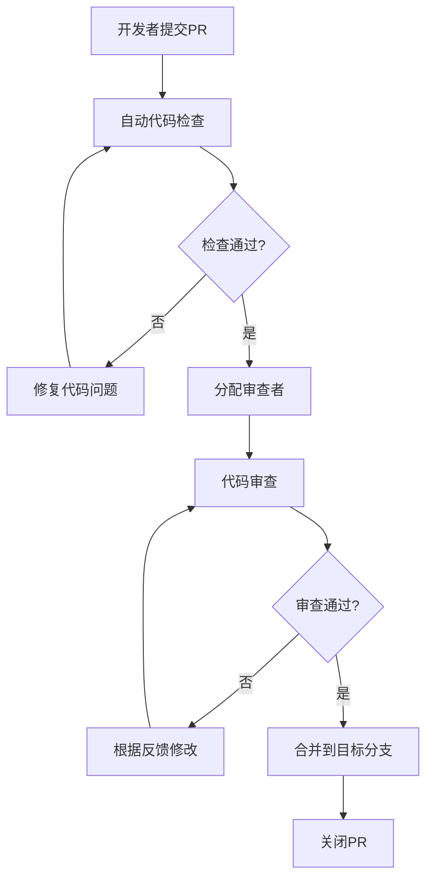

# 开发与部署流程规范

## 1. 开发流程规范

### 1.1 Git工作流
```
┌─────────────────────────────────────────────────────────────┐
│                    Git Flow 工作流                          │
├─────────────────────────────────────────────────────────────┤
│                                                             │
│  main (生产环境)                                            │
│    │                                                        │
│    ├─ hotfix/* (紧急修复)                                  │
│    │                                                        │
│  develop (开发环境)                                         │
│    │                                                        │
│    ├─ feature/* (功能开发)                                 │
│    │   │                                                    │
│    │   ├─ feature/user-management                          │
│    │   ├─ feature/api-optimization                        │
│    │   └─ feature/ui-redesign                              │
│    │                                                        │
│    ├─ release/* (发布准备)                                  │
│    │   │                                                    │
│    │   ├─ release/v1.2.0                                   │
│    │   └─ release/v1.3.0                                   │
│    │                                                        │
│    └─ bugfix/* (bug修复)                                   │
│        │                                                    │
│        ├─ bugfix/login-error                               │
│        └─ bugfix/permission-issue                          │
│                                                             │
└─────────────────────────────────────────────────────────────┘
```

### 1.2 分支命名规范
```
# 功能分支
feature/{功能名称}
feature/user-management
feature/api-optimization

# Bug修复分支
bugfix/{问题描述}
bugfix/login-error
bugfix/permission-issue

# 热修复分支
hotfix/{问题描述}
hotfix/security-vulnerability
hotfix/critical-performance-issue

# 发布分支
release/{版本号}
release/v1.2.0
release/v2.0.0

# 文档分支
docs/{文档类型}
docs/api-documentation
docs/deployment-guide
```

### 1.3 提交信息规范
```
# 提交格式
type(scope): subject

# 提交类型
type 说明:
  feat: 新功能
  fix: 修复bug
  docs: 文档更新
  style: 代码格式调整
  refactor: 代码重构
  test: 测试相关
  chore: 构建过程或辅助工具的变动
  perf: 性能优化
  ci: CI/CD相关
  build: 构建相关
  revert: 回滚提交

# 作用域(scope)
scope 说明:
  api: API接口
  ui: 用户界面
  auth: 认证授权
  store: 状态管理
  router: 路由配置
  utils: 工具函数
  components: 组件
  views: 页面
  config: 配置文件
  docs: 文档

# 提交示例
feat(auth): 添加多因子认证功能
fix(api): 修复用户列表分页错误
docs(readme): 更新项目部署说明
style(components): 统一按钮组件样式
refactor(utils): 优化日期格式化函数
perf(table): 优化大数据表格渲染性能
test(auth): 添加登录单元测试
chore(deps): 更新依赖包版本
```

### 1.4 代码审查流程


## 2. 代码质量规范

### 2.1 ESLint配置
```javascript
// .eslintrc.js
module.exports = {
  root: true,
  env: {
    node: true,
    browser: true,
    es2022: true
  },
  extends: [
    'eslint:recommended',
    '@vue/eslint-config-typescript',
    '@vue/eslint-config-prettier',
    'plugin:vue/vue3-essential',
    'plugin:vue/vue3-strongly-recommended',
    'plugin:vue/vue3-recommended'
  ],
  parserOptions: {
    ecmaVersion: 2022,
    sourceType: 'module',
    parser: '@typescript-eslint/parser'
  },
  rules: {
    // Vue相关规则
    'vue/multi-word-component-names': 'error',
    'vue/component-definition-name-casing': ['error', 'PascalCase'],
    'vue/component-name-in-template-casing': ['error', 'PascalCase'],
    'vue/prop-name-casing': ['error', 'camelCase'],
    'vue/custom-event-name-casing': ['error', 'camelCase'],
    'vue/attribute-hyphenation': ['error', 'always'],
    'vue/html-closing-bracket-newline': 'error',
    'vue/html-closing-bracket-spacing': 'error',
    'vue/html-end-tags': 'error',
    'vue/html-indent': ['error', 2],
    'vue/html-quotes': ['error', 'double'],
    'vue/mustache-interpolation-spacing': 'error',
    'vue/no-multi-spaces': 'error',
    'vue/no-spaces-around-equal-signs-in-attribute': 'error',
    'vue/v-bind-style': ['error', 'shorthand'],
    'vue/v-on-style': ['error', 'shorthand'],
    'vue/v-slot-style': ['error', 'shorthand'],
    
    // TypeScript相关规则
    '@typescript-eslint/no-unused-vars': 'error',
    '@typescript-eslint/no-explicit-any': 'warn',
    '@typescript-eslint/explicit-function-return-type': 'off',
    '@typescript-eslint/explicit-module-boundary-types': 'off',
    '@typescript-eslint/no-empty-function': 'warn',
    '@typescript-eslint/no-non-null-assertion': 'warn',
    
    // 通用规则
    'no-console': process.env.NODE_ENV === 'production' ? 'error' : 'warn',
    'no-debugger': process.env.NODE_ENV === 'production' ? 'error' : 'warn',
    'no-unused-vars': 'off', // 使用TypeScript的规则
    'prefer-const': 'error',
    'no-var': 'error',
    'object-shorthand': 'error',
    'prefer-arrow-callback': 'error',
    'prefer-template': 'error',
    'template-curly-spacing': 'error',
    'arrow-spacing': 'error',
    'comma-dangle': ['error', 'never'],
    'semi': ['error', 'never'],
    'quotes': ['error', 'single'],
    'indent': ['error', 2],
    'max-len': ['error', { code: 120 }],
    'no-trailing-spaces': 'error',
    'eol-last': 'error',
    'no-multiple-empty-lines': ['error', { max: 1 }]
  },
  overrides: [
    {
      files: ['*.vue'],
      rules: {
        'no-unused-vars': 'off'
      }
    }
  ]
}
```

### 2.2 Prettier配置
```json
// .prettierrc
{
  "printWidth": 120,
  "tabWidth": 2,
  "useTabs": false,
  "semi": false,
  "singleQuote": true,
  "quoteProps": "as-needed",
  "trailingComma": "none",
  "bracketSpacing": true,
  "bracketSameLine": false,
  "arrowParens": "avoid",
  "endOfLine": "lf",
  "htmlWhitespaceSensitivity": "css",
  "vueIndentScriptAndStyle": true,
  "embeddedLanguageFormatting": "auto"
}
```

### 2.3 TypeScript配置
```json
// tsconfig.json
{
  "compilerOptions": {
    "target": "ES2020",
    "useDefineForClassFields": true,
    "lib": ["ES2020", "DOM", "DOM.Iterable"],
    "module": "ESNext",
    "skipLibCheck": true,
    "moduleResolution": "bundler",
    "allowImportingTsExtensions": true,
    "resolveJsonModule": true,
    "isolatedModules": true,
    "noEmit": true,
    "jsx": "preserve",
    "strict": true,
    "noUnusedLocals": true,
    "noUnusedParameters": true,
    "noFallthroughCasesInSwitch": true,
    "allowSyntheticDefaultImports": true,
    "forceConsistentCasingInFileNames": true,
    "baseUrl": ".",
    "paths": {
      "@/*": ["src/*"],
      "@/components/*": ["src/components/*"],
      "@/views/*": ["src/views/*"],
      "@/utils/*": ["src/utils/*"],
      "@/api/*": ["src/api/*"],
      "@/store/*": ["src/store/*"],
      "@/types/*": ["src/types/*"],
      "@/assets/*": ["src/assets/*"],
      "@/router/*": ["src/router/*"],
      "@/directive/*": ["src/directive/*"],
      "@/hooks/*": ["src/hooks/*"]
    }
  },
  "include": [
    "src/**/*.ts",
    "src/**/*.d.ts",
    "src/**/*.tsx",
    "src/**/*.vue"
  ],
  "references": [{ "path": "./tsconfig.node.json" }]
}
```

### 2.4 代码质量检查脚本
```json
// package.json
{
  "scripts": {
    "lint": "eslint . --ext .vue,.js,.jsx,.cjs,.mjs,.ts,.tsx,.cts,.mts --fix --ignore-path .gitignore",
    "lint:check": "eslint . --ext .vue,.js,.jsx,.cjs,.mjs,.ts,.tsx,.cts,.mts --ignore-path .gitignore",
    "format": "prettier --write src/",
    "format:check": "prettier --check src/",
    "type-check": "vue-tsc --noEmit",
    "test:unit": "vitest",
    "test:e2e": "playwright test",
    "test:coverage": "vitest --coverage",
    "quality": "npm run lint:check && npm run format:check && npm run type-check",
    "quality:fix": "npm run lint && npm run format && npm run type-check"
  }
}
```

## 3. 测试策略

### 3.1 单元测试配置
```typescript
// vitest.config.ts
import { defineConfig } from 'vitest/config'
import vue from '@vitejs/plugin-vue'
import { resolve } from 'path'

export default defineConfig({
  plugins: [vue()],
  test: {
    globals: true,
    environment: 'jsdom',
    coverage: {
      provider: 'v8',
      reporter: ['text', 'json', 'html'],
      exclude: [
        'node_modules/',
        'tests/',
        '**/*.d.ts',
        '**/*.config.*',
        '**/mock/**',
        '**/dist/**',
        '**/cypress/**',
        '**/.{eslint,prettier}rc.{js,cjs,yml}',
        '**/vite.config.*',
        '**/vitest.config.*',
        '**/astro.config.*',
        '**/svelte.config.*'
      ],
      thresholds: {
        lines: 80,
        functions: 80,
        branches: 80,
        statements: 80
      }
    }
  },
  resolve: {
    alias: {
      '@': resolve(__dirname, './src')
    }
  }
})
```

### 3.2 测试目录结构
```
tests/
├── unit/                    # 单元测试
│   ├── components/          # 组件测试
│   │   ├── Button.test.ts
│   │   ├── Table.test.ts
│   │   └── Modal.test.ts
│   ├── utils/               # 工具函数测试
│   │   ├── format.test.ts
│   │   ├── validation.test.ts
│   │   └── request.test.ts
│   ├── store/               # 状态管理测试
│   │   ├── user.test.ts
│   │   └── app.test.ts
│   └── api/                 # API测试
│       ├── user.test.ts
│       └── auth.test.ts
├── e2e/                     # 端到端测试
│   ├── specs/               # 测试用例
│   │   ├── login.spec.ts
│   │   ├── dashboard.spec.ts
│   │   └── user-management.spec.ts
│   ├── pages/               # 页面对象
│   │   ├── LoginPage.ts
│   │   ├── DashboardPage.ts
│   │   └── UserPage.ts
│   └── fixtures/            # 测试数据
│       ├── users.json
│       └── auth.json
└── integration/             # 集成测试
    ├── api-integration.test.ts
    └── auth-integration.test.ts
```

### 3.3 测试示例
```typescript
// tests/unit/components/Button.test.ts
import { describe, it, expect } from 'vitest'
import { mount } from '@vue/test-utils'
import Button from '@/components/Button.vue'

describe('Button', () => {
  it('renders properly', () => {
    const wrapper = mount(Button, {
      props: { 
        label: 'Click me',
        type: 'primary'
      }
    })
    expect(wrapper.text()).toContain('Click me')
    expect(wrapper.classes()).toContain('btn-primary')
  })

  it('emits click event', async () => {
    const wrapper = mount(Button, {
      props: { label: 'Click me' }
    })
    await wrapper.trigger('click')
    expect(wrapper.emitted()).toHaveProperty('click')
  })

  it('disables button when loading', () => {
    const wrapper = mount(Button, {
      props: { 
        label: 'Loading',
        loading: true
      }
    })
    expect(wrapper.attributes('disabled')).toBeDefined()
    expect(wrapper.classes()).toContain('btn-loading')
  })
})
```

## 4. 构建与部署

### 4.1 构建配置
```typescript
// vite.config.ts
import { defineConfig, loadEnv } from 'vite'
import vue from '@vitejs/plugin-vue'
import { resolve } from 'path'

export default defineConfig(({ mode }) => {
  const env = loadEnv(mode, process.cwd(), '')
  
  return {
    plugins: [vue()],
    resolve: {
      alias: {
        '@': resolve(__dirname, 'src')
      }
    },
    build: {
      target: 'es2015',
      outDir: 'dist',
      assetsDir: 'assets',
      sourcemap: mode === 'development',
      minify: 'terser',
      terserOptions: {
        compress: {
          drop_console: mode === 'production',
          drop_debugger: mode === 'production'
        }
      },
      rollupOptions: {
        output: {
          chunkFileNames: 'js/[name]-[hash].js',
          entryFileNames: 'js/[name]-[hash].js',
          assetFileNames: '[ext]/[name]-[hash].[ext]',
          manualChunks: {
            vue: ['vue'],
            'element-plus': ['element-plus'],
            'vue-router': ['vue-router'],
            pinia: ['pinia']
          }
        }
      },
      chunkSizeWarningLimit: 1000
    },
    server: {
      port: 8001,
      host: true,
      open: true,
      proxy: {
        '/api': {
          target: env.VITE_API_BASE_URL,
          changeOrigin: true,
          rewrite: path => path.replace(/^\/api/, '')
        }
      }
    }
  }
})
```

### 4.2 环境配置
```typescript
// .env.development
VITE_APP_TITLE=Vue3 Element Admin (Development)
VITE_API_BASE_URL=https://api-dev.example.com
VITE_BASE_API=/api
VITE_UPLOAD_URL=https://upload-dev.example.com
VITE_TOKEN_KEY=access_token
VITE_TOKEN_ENCRYPTION_KEY=your-dev-encryption-key
VITE_APP_VERSION=1.0.0
VITE_BUILD_TIME=new Date().toISOString()

// .env.staging
VITE_APP_TITLE=Vue3 Element Admin (Staging)
VITE_API_BASE_URL=https://api-staging.example.com
VITE_BASE_API=/api
VITE_UPLOAD_URL=https://upload-staging.example.com
VITE_TOKEN_KEY=access_token
VITE_TOKEN_ENCRYPTION_KEY=your-staging-encryption-key
VITE_APP_VERSION=1.0.0
VITE_BUILD_TIME=new Date().toISOString()

// .env.production
VITE_APP_TITLE=Vue3 Element Admin
VITE_API_BASE_URL=https://api.example.com
VITE_BASE_API=/api
VITE_UPLOAD_URL=https://upload.example.com
VITE_TOKEN_KEY=access_token
VITE_TOKEN_ENCRYPTION_KEY=your-production-encryption-key
VITE_APP_VERSION=1.0.0
VITE_BUILD_TIME=new Date().toISOString()
```

### 4.3 Docker配置
```dockerfile
# Dockerfile
FROM node:18-alpine as builder

WORKDIR /app

# 复制依赖文件
COPY package*.json ./
RUN npm ci --only=production

# 复制源码
COPY . .

# 构建应用
RUN npm run build

# 生产环境镜像
FROM nginx:alpine

# 复制构建产物
COPY --from=builder /app/dist /usr/share/nginx/html

# 复制nginx配置
COPY nginx.conf /etc/nginx/nginx.conf

# 暴露端口
EXPOSE 80

# 健康检查
HEALTHCHECK --interval=30s --timeout=3s --start-period=5s --retries=3 \
  CMD curl -f http://localhost/ || exit 1

CMD ["nginx", "-g", "daemon off;"]
```

### 4.4 Nginx配置
```nginx
# nginx.conf
user nginx;
worker_processes auto;
error_log /var/log/nginx/error.log;
pid /run/nginx.pid;

events {
    worker_connections 1024;
    use epoll;
    multi_accept on;
}

http {
    log_format main '$remote_addr - $remote_user [$time_local] "$request" '
                    '$status $body_bytes_sent "$http_referer" '
                    '"$http_user_agent" "$http_x_forwarded_for"';

    access_log /var/log/nginx/access.log main;

    sendfile on;
    tcp_nopush on;
    tcp_nodelay on;
    keepalive_timeout 65;
    types_hash_max_size 2048;
    client_max_body_size 50M;

    include /etc/nginx/mime.types;
    default_type application/octet-stream;

    # Gzip配置
    gzip on;
    gzip_vary on;
    gzip_min_length 1024;
    gzip_comp_level 6;
    gzip_types
        text/plain
        text/css
        text/xml
        text/javascript
        application/json
        application/javascript
        application/xml+rss
        application/atom+xml
        image/svg+xml;

    # 安全头配置
    add_header X-Frame-Options "SAMEORIGIN" always;
    add_header X-Content-Type-Options "nosniff" always;
    add_header X-XSS-Protection "1; mode=block" always;
    add_header Referrer-Policy "strict-origin-when-cross-origin" always;
    add_header Content-Security-Policy "default-src 'self'; script-src 'self' 'unsafe-inline' 'unsafe-eval'; style-src 'self' 'unsafe-inline'; img-src 'self' data: https:; font-src 'self' data:; connect-src 'self' https:;" always;

    server {
        listen 80;
        server_name localhost;
        root /usr/share/nginx/html;
        index index.html;

        # 前端路由配置
        location / {
            try_files $uri $uri/ /index.html;
        }

        # API代理配置
        location /api/ {
            proxy_pass https://api.example.com/;
            proxy_set_header Host $host;
            proxy_set_header X-Real-IP $remote_addr;
            proxy_set_header X-Forwarded-For $proxy_add_x_forwarded_for;
            proxy_set_header X-Forwarded-Proto $scheme;
            
            # 超时配置
            proxy_connect_timeout 60s;
            proxy_send_timeout 60s;
            proxy_read_timeout 60s;
        }

        # 静态资源缓存配置
        location ~* \.(js|css|png|jpg|jpeg|gif|ico|svg|woff|woff2|ttf|eot)$ {
            expires 1y;
            add_header Cache-Control "public, immutable";
            access_log off;
        }

        # 错误页面配置
        error_page 404 /404.html;
        error_page 500 502 503 504 /50x.html;
        location = /50x.html {
            root /usr/share/nginx/html;
        }
    }
}
```

### 4.5 CI/CD配置
```yaml
# .github/workflows/ci-cd.yml
name: CI/CD Pipeline

on:
  push:
    branches: [main, develop]
  pull_request:
    branches: [main, develop]

env:
  NODE_VERSION: '18'
  REGISTRY: ghcr.io
  IMAGE_NAME: ${{ github.repository }}

jobs:
  test:
    runs-on: ubuntu-latest
    steps:
      - name: Checkout code
        uses: actions/checkout@v4

      - name: Setup Node.js
        uses: actions/setup-node@v4
        with:
          node-version: ${{ env.NODE_VERSION }}
          cache: 'npm'

      - name: Install dependencies
        run: npm ci

      - name: Run lint
        run: npm run lint:check

      - name: Run type check
        run: npm run type-check

      - name: Run unit tests
        run: npm run test:unit

      - name: Run build
        run: npm run build

      - name: Upload coverage reports
        uses: codecov/codecov-action@v3
        with:
          file: ./coverage/lcov.info
          flags: unittests
          name: codecov-umbrella

  e2e:
    runs-on: ubuntu-latest
    needs: test
    steps:
      - name: Checkout code
        uses: actions/checkout@v4

      - name: Setup Node.js
        uses: actions/setup-node@v4
        with:
          node-version: ${{ env.NODE_VERSION }}
          cache: 'npm'

      - name: Install dependencies
        run: npm ci

      - name: Install Playwright
        run: npx playwright install --with-deps

      - name: Run e2e tests
        run: npm run test:e2e

      - name: Upload e2e test results
        uses: actions/upload-artifact@v3
        if: always()
        with:
          name: playwright-report
          path: playwright-report/
          retention-days: 30

  build-and-push:
    runs-on: ubuntu-latest
    needs: [test, e2e]
    if: github.ref == 'refs/heads/main'
    steps:
      - name: Checkout code
        uses: actions/checkout@v4

      - name: Setup Docker Buildx
        uses: docker/setup-buildx-action@v3

      - name: Log in to Container Registry
        uses: docker/login-action@v3
        with:
          registry: ${{ env.REGISTRY }}
          username: ${{ github.actor }}
          password: ${{ secrets.GITHUB_TOKEN }}

      - name: Extract metadata
        id: meta
        uses: docker/metadata-action@v5
        with:
          images: ${{ env.REGISTRY }}/${{ env.IMAGE_NAME }}
          tags: |
            type=ref,event=branch
            type=ref,event=pr
            type=semver,pattern={{version}}
            type=semver,pattern={{major}}.{{minor}}
            type=sha,prefix={{branch}}-

      - name: Build and push Docker image
        uses: docker/build-push-action@v5
        with:
          context: .
          push: true
          tags: ${{ steps.meta.outputs.tags }}
          labels: ${{ steps.meta.outputs.labels }}
          cache-from: type=gha
          cache-to: type=gha,mode=max

  deploy:
    runs-on: ubuntu-latest
    needs: build-and-push
    if: github.ref == 'refs/heads/main'
    environment: production
    steps:
      - name: Deploy to production
        run: |
          echo "Deploying to production..."
          # 这里添加实际的部署脚本
          # 例如: kubectl apply -f k8s/
          # 或者: ssh user@server 'docker-compose up -d'

  notify:
    runs-on: ubuntu-latest
    needs: [deploy]
    if: always()
    steps:
      - name: Notify deployment status
        uses: 8398a7/action-slack@v3
        with:
          status: ${{ job.status }}
          channel: '#deployments'
          webhook_url: ${{ secrets.SLACK_WEBHOOK }}
        if: always()
```

## 5. 监控与告警

### 5.1 应用性能监控
```typescript
// utils/monitoring.ts
class MonitoringService {
  private static instance: MonitoringService;
  private metrics: Map<string, number> = new Map();
  
  static getInstance(): MonitoringService {
    if (!this.instance) {
      this.instance = new MonitoringService();
    }
    return this.instance;
  }
  
  // 记录性能指标
  recordMetric(name: string, value: number): void {
    this.metrics.set(name, value);
    
    // 发送到监控服务
    this.sendToMonitoring({
      metric: name,
      value,
      timestamp: Date.now(),
      tags: {
        environment: import.meta.env.MODE,
        version: import.meta.env.VITE_APP_VERSION
      }
    });
  }
  
  // 记录错误
  recordError(error: Error, context?: any): void {
    const errorInfo = {
      message: error.message,
      stack: error.stack,
      context,
      timestamp: Date.now(),
      userAgent: navigator.userAgent,
      url: window.location.href
    };
    
    // 发送到错误监控服务
    this.sendToMonitoring({
      type: 'error',
      payload: errorInfo
    });
  }
  
  // 监控API性能
  monitorAPIPerformance(url: string, duration: number, success: boolean): void {
    this.recordMetric(`api_${url}_duration`, duration);
    this.recordMetric(`api_${url}_success`, success ? 1 : 0);
  }
  
  // 监控页面性能
  monitorPagePerformance(): void {
    if ('performance' in window) {
      window.addEventListener('load', () => {
        const timing = performance.timing;
        const loadTime = timing.loadEventEnd - timing.navigationStart;
        
        this.recordMetric('page_load_time', loadTime);
        this.recordMetric('dom_ready_time', timing.domContentLoadedEventEnd - timing.navigationStart);
        this.recordMetric('first_paint', timing.responseStart - timing.navigationStart);
      });
    }
  }
  
  private sendToMonitoring(data: any): void {
    // 发送到监控服务（如Prometheus、Grafana、Sentry等）
    fetch('/api/monitoring/metrics', {
      method: 'POST',
      headers: { 'Content-Type': 'application/json' },
      body: JSON.stringify(data)
    }).catch(console.error);
  }
}

export const monitoring = MonitoringService.getInstance();
```

### 5.2 健康检查
```typescript
// utils/health-check.ts
class HealthCheck {
  private static checks: Map<string, () => Promise<boolean>> = new Map();
  
  // 注册健康检查
  static register(name: string, check: () => Promise<boolean>): void {
    this.checks.set(name, check);
  }
  
  // 执行健康检查
  static async run(): Promise<HealthReport> {
    const results: HealthReport = {
      status: 'healthy',
      timestamp: new Date().toISOString(),
      checks: {}
    };
    
    for (const [name, check] of this.checks) {
      try {
        const isHealthy = await check();
        results.checks[name] = {
          status: isHealthy ? 'healthy' : 'unhealthy',
          timestamp: new Date().toISOString()
        };
        
        if (!isHealthy) {
          results.status = 'unhealthy';
        }
      } catch (error) {
        results.checks[name] = {
          status: 'error',
          error: error.message,
          timestamp: new Date().toISOString()
        };
        results.status = 'unhealthy';
      }
    }
    
    return results;
  }
}

interface HealthReport {
  status: 'healthy' | 'unhealthy';
  timestamp: string;
  checks: Record<string, HealthCheckResult>;
}

interface HealthCheckResult {
  status: 'healthy' | 'unhealthy' | 'error';
  error?: string;
  timestamp: string;
}

// 注册健康检查
HealthCheck.register('api', async () => {
  try {
    const response = await fetch('/api/health');
    return response.ok;
  } catch {
    return false;
  }
});

HealthCheck.register('database', async () => {
  // 检查数据库连接
  return true;
});

HealthCheck.register('storage', async () => {
  // 检查存储服务
  return true;
});
```

这个开发与部署流程规范文档为项目提供了完整的工程化指导，涵盖了从代码开发到部署运维的全流程规范。通过实施这些规范，可以确保项目的代码质量、部署可靠性和运维效率。